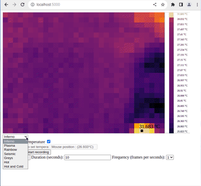

# Framer.py - Thermal Camera Data Visualization
[](https://github.com/emersion/stability-badges#experimental)
[](https://github.com/ffmpegwasm/ffmpeg.wasm/graphs/commit-activity)
[](https://opensource.org/licenses/MIT)
## Overview


**Framer.py** is a Python application that visualizes thermal camera data from the MLX90640 model connected to a Raspberry Pi 4B via the I2C bus. The application utilizes SocketIO, Adafruit libraries, and Flask to provide a real-time interactive experience. Explore and analyze temperature distributions in a user-friendly HTML canvas.

## Features

- Real-time visualization of thermal camera data on an HTML canvas.
- Change the color map using a select box for enhanced data interpretation.
- Display temperature under the mouse cursor for instant feedback.
- Follow the hottest temperature and hottest spot on canvas.
- Left-click to view the temperature at a specific canvas point.
- Temperature scale on the right side of the canvas for reference.
- Capture .png image of actual data in canvas.
- Start/Stop video recording for up to 10 minutes in highest possible quality 2 FPS
- Time lapse recording with choice of frame rate.
- Multi-instance and independent clients in a local network
- Saving in local host files with precisely date and time of capture.

## Technologies Used

- **SocketIO:** Enables real-time communication between server and client.
- **Adafruit Libraries:** Interfacing with the MLX90640 thermal camera via the I2C bus.
- **Flask:** Web framework to serve the HTML interface and handle user interactions.

## Setup

1. Connect the MLX90640 thermal camera to the Raspberry Pi 4B via the I2C bus.
2. Install required Python libraries:

    ```bash
    pip install adafruit-circuitpython-mlx90640 flask python-socketio
    ```

3. Run the application:

    ```bash
    python framer.py
    ```

4. Access the application in your web browser at `http://<raspberry_pi_ip>:5000`.

## Notes

- The camera captures 2 frames per minute, resulting in a 2Hz frequency.
- Modifying this parameter may cause delays, as observed and tested in `test.py` from the Adafruit example.

## Contributions

Contributions and feedback are welcome! Open issues or submit pull requests to enhance Framer.py's functionality and usability.
